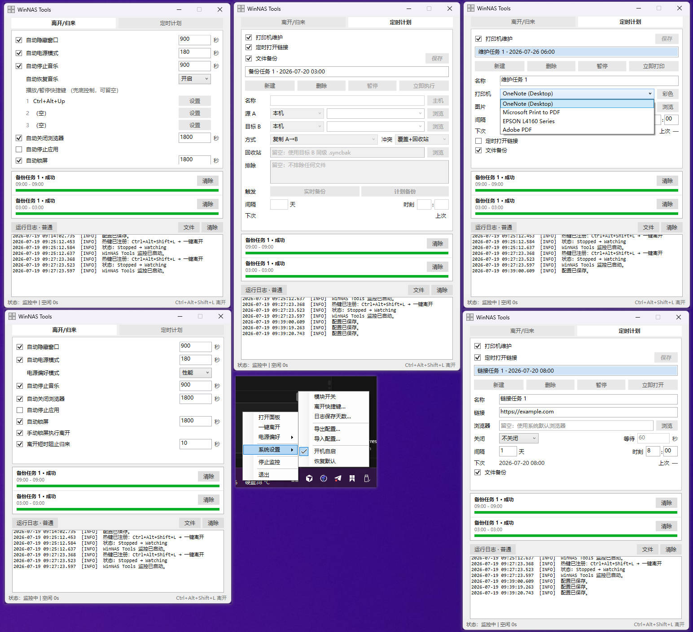

# WinNAS Tools

<div align="center">

[?? ????](#zh-cn)?|?[?? ????](#zh-tw)?|?[?? English](#en)

</div>

---

<a id="zh-cn"></a>

## ?? ????

- Windows ???? DIY NAS ?????????????
- ?????????????? WinNAS ???????????
- ???? Windows ?????
- Windows 11 ?????????????? bug?

?????**[v0.8.0](https://github.com/shengshk/WinNASTools/releases/tag/v0.8.0)**?????????? 1.0?

### Windows ?????

- ?? / ??????????????????????????
- ??????????????????????????

### ????

???????????? Cursor ????????????????????????

- ????????????? **Fork**???????????
- ????**?? Bug** ??? PR?? PR ????????????????

```markdown
## ????
??? / ???????????
## ????
1. ?
2. ?
## ????
- ????
- ????
## ????
- [ ] ???????????
- [ ] ?? Bug???????
```

### ????

#### ?? / ??

- **??????**????????????????????????????
- **??????**????????????? / ???????????
- **??????**????????? ? ?????/????? ? ?????????????????
- **???????** / **??????** / **????**????????????
- **????????**?Win+L ??????????????
- **????????**??? / ??????????????? 2 ????????

#### ????

- **?????**???? + ??????????????????
- **????**??? / ?? / ?????? SMB / WebDAV ????????
- **??????**???????????? URL???????

#### ?????

- ?????????????????????? / ?? / ???? / ?? / ??????
- ??????? **???? / ???? / English**??????????????????
- ?????**Ctrl+Alt+Shift+L**????

#### ??



### ????

#### ?????

1. ? [Releases](https://github.com/shengshk/WinNASTools/releases) ???? `WinNASTools.exe`??? [v0.8.0](https://github.com/shengshk/WinNASTools/releases/tag/v0.8.0)?
2. ????????????? exe ???? `data/`
3. ???????????

?????

```
????/
  WinNASTools.exe
  data/                 # ????????
    WinNasToolsConfig.json
    winnas-tools.log
    assets/
```

#### ??????Windows x64?

?? [.NET 8 SDK](https://dotnet.microsoft.com/download/dotnet/8.0)?

```powershell
cd "WinNAS Tools"
.\publish-singlefile.bat
```

???`publish\WinNASTools.exe`????????? 70MB??`publish\data` ????????

????

```powershell
dotnet publish ".\WinNAS Tools.App\WinNAS Tools.App.csproj" -c Release -r win-x64 --self-contained true -p:PublishSingleFile=true -o ".\publish"
```

#### ????

??? `WinNasToolsConfig.example.json` ??????  
**????**??????????????????????????

?????`Ui.Language`??`auto` | `zh-CN` | `zh-TW` | `en`?

### ??

```
WinNAS Tools.sln
WinNAS Tools.App/          WPF ?????
WinNAS Tools.Core/         ????????????
docs/                      ???
publish-singlefile.bat     ????
WinNasToolsConfig.example.json
LICENSE                    MIT
```

### ???? / ????

1. ?????????????????????????????????????????????????????
2. ???????????????????????????????????????????????????????????????????????????????????
3. ??????????? / ???? / ???? / ???????????????????
4. ?????????????????? DPAPI ??????**???????????????**?
5. ?????????????????????????

### License

[MIT](LICENSE)

<p align="right"><a href="#">? ???</a></p>

---

<a id="zh-tw"></a>

## ?? ????

- Windows ???? DIY NAS ?????????????
- ????????????? WinNAS ???????????
- ?? Windows ???????
- Windows 11 ?????????????? bug?

?????**[v0.8.0](https://github.com/shengshk/WinNASTools/releases/tag/v0.8.0)**?????????? 1.0?

### Windows ?????

- ?? / ?????????????????????????????
- ??????????????????????????

### ????

???????????? Cursor ?????????????????????

- ????????????? **Fork**???????????
- ????**?? Bug** ??? PR?? PR ????????????????

```markdown
## ????
??? / ???????????
## ????
1. ?
2. ?
## ????
- ????
- ????
## ????
- [ ] ???????????
- [ ] ?? Bug???????
```

### ????

#### ?? / ??

- **??????**????????????????????????????
- **??????**????????????? / ???????????
- **??????**????????? ? ????/????? ? ?????????????????
- **???????** / **??????** / **??????**?????????????
- **????????**?Win+L ??????????????
- **????????**??? / ??????????????? 2 ????????

#### ????

- **?????**???? + ??????????????????
- **????**??? / ?? / ?????? SMB / WebDAV ????????
- **??????**???????????? URL???????

#### ?????

- ?????????????????????? / ?? / ???? / **??** / ??????
- ??????? **???? / ???? / English**????????????????????
- ?????**Ctrl+Alt+Shift+L**????

#### ??


### ????

#### ?????

1. ? [Releases](https://github.com/shengshk/WinNASTools/releases) ???? `WinNASTools.exe`??? [v0.8.0](https://github.com/shengshk/WinNASTools/releases/tag/v0.8.0)?
2. ????????????? exe ???? `data/`
3. ???????????

?????

```
????/
  WinNASTools.exe
  data/                 # ????????
    WinNasToolsConfig.json
    winnas-tools.log
    assets/
```

#### ???????Windows x64?

?? [.NET 8 SDK](https://dotnet.microsoft.com/download/dotnet/8.0)?

```powershell
cd "WinNAS Tools"
.\publish-singlefile.bat
```

???`publish\WinNASTools.exe`???????? 70MB??`publish\data` ????????

????

```powershell
dotnet publish ".\WinNAS Tools.App\WinNAS Tools.App.csproj" -c Release -r win-x64 --self-contained true -p:PublishSingleFile=true -o ".\publish"
```

#### ????

??? `WinNasToolsConfig.example.json` ??????  
**????**??????????????????????????

?????`Ui.Language`??`auto` | `zh-CN` | `zh-TW` | `en`?

### ??

```
WinNAS Tools.sln
WinNAS Tools.App/          WPF ?????
WinNAS Tools.Core/         ????????????
docs/                      ???
publish-singlefile.bat     ????
WinNasToolsConfig.example.json
LICENSE                    MIT
```

### ???? / ????

1. ?????????????????????????????????????????????????????
2. ????????????????????????????????????????????????????????????????????????????????????
3. ??????????? / ????? / ???? / ?????????????????????
4. ?????????????????? DPAPI ??????**???????????????**?
5. ?????????????????????????

### License

[MIT](LICENSE)

<p align="right"><a href="#">? ???</a></p>

---

<a id="en"></a>

## ?? English

- Windows is a great OS for DIY NAS ? feel free to disagree;
- This tool tries to make a WinNAS more flexible and lower idle power draw, based on personal habits;
- Fine for everyday Windows desktops too;
- Lightly tested on Windows 11; serious bugs may still exist.

Current release: **[v0.8.0](https://github.com/shengshk/WinNASTools/releases/tag/v0.8.0)** (early usable; not yet 1.0)

### Windows tray utility

- Idle / return: auto hide/show windows, switch power plan, stop/resume music, close browsers, lock screen;
- Also inkjet printer maintenance and simple file backup; optional scheduled URL open.

### Before you open an issue

The author is an amateur; the project is built mainly with Cursor, spare-time, for personal use:

- Feature requests / large redesigns: please **Fork**; this repo will not expand scope for now;
- Bug-fix PRs for **clear bugs** are welcome. Prefer this format:

```markdown
## Screenshots
(UI / logs that show the issue)
## Steps to reproduce
1. ?
2. ?
## Fix notes
- Cause: ?
- Change: ?
## Verified
- [ ] Reproduced fix locally
- [ ] Bug fix only; no intentional behavior change
```

### Features

#### Leave / return

- **Auto hide windows**: minimize normal windows after idle; restore on return (this app stays in the tray)
- **Auto power plan**: power saver on leave; restore Performance / Balanced on return (or Manual = no switch)
- **Auto stop music**: stepped pause (system keys ? custom play/pause hotkeys ? system mute fallback); resume via the method that worked
- **Auto close browser** / **Auto stop apps** / **Auto lock** (lock also requests display off)
- **Run leave on manual lock**: optional leave pass on Win+L etc.
- **Short leave grace**: shared by one-click and auto leave; then ~2 consecutive seconds of activity before return

#### Schedule

- **Printer maintenance**: inkjet test page by interval + time of day; skip if missed too long
- **File backup**: copy / mirror / sync; local or SMB / WebDAV hosts; planned or realtime
- **Scheduled open URL**: open a URL in a chosen browser on schedule; optional delayed close

#### Tray & hotkeys

- Left-click opens the panel; right-click: leave now, settings (modules / hotkey / log retention / **language** / autostart, etc.)
- UI and logs: **Simplified Chinese / Traditional Chinese / English** (default follows system; changing language restarts the app)
- Default leave hotkey: **Ctrl+Alt+Shift+L** (editable)

#### Screenshot


### Quick start

#### Run the release build

1. Download `WinNASTools.exe` from [Releases](https://github.com/shengshk/WinNASTools/releases) (current [v0.8.0](https://github.com/shengshk/WinNASTools/releases/tag/v0.8.0))
2. Run from any folder; first launch creates `data/` next to the exe
3. Use the tray icon

Portable layout:

```
SomeFolder/
  WinNASTools.exe
  data/                 # created on first run
    WinNasToolsConfig.json
    winnas-tools.log
    assets/
```

#### Build from source (Windows x64)

Requires [.NET 8 SDK](https://dotnet.microsoft.com/download/dotnet/8.0).

```powershell
cd "WinNAS Tools"
.\publish-singlefile.bat
```

Output: `publish\WinNASTools.exe` (self-contained single file, ~70MB). `publish\data` is not overwritten by the script.

Or:

```powershell
dotnet publish ".\WinNAS Tools.App\WinNAS Tools.App.csproj" -c Release -r win-x64 --self-contained true -p:PublishSingleFile=true -o ".\publish"
```

#### Config sample

See `WinNasToolsConfig.example.json` for structure.  
**Do not commit** real local configs (may contain DPAPI-protected host passwords and paths).

Language (`Ui.Language`): `auto` | `zh-CN` | `zh-TW` | `en`.

### Layout

```
WinNAS Tools.sln
WinNAS Tools.App/          WPF tray & UI
WinNAS Tools.Core/         leave engine, features, backup
docs/                      screenshots, etc.
publish-singlefile.bat
WinNasToolsConfig.example.json
LICENSE                    MIT
```

### Disclaimer

1. For learning, research, and personal use only; no warranty of accuracy, completeness, or fitness. Follow local laws.
2. By using, modifying, or distributing this project you accept this disclaimer; any consequences (data loss, killed processes, ink use, privacy, etc.) are your own responsibility.
3. Leave actions may close browsers / stop processes / switch power / lock the screen ? review settings and save work first.
4. Backup host passwords are protected locally (e.g. DPAPI); **never put real credentials in the public repo**.
5. This disclaimer may be updated without notice.

### License

[MIT](LICENSE)

<p align="right"><a href="#">? Back to top</a></p>
